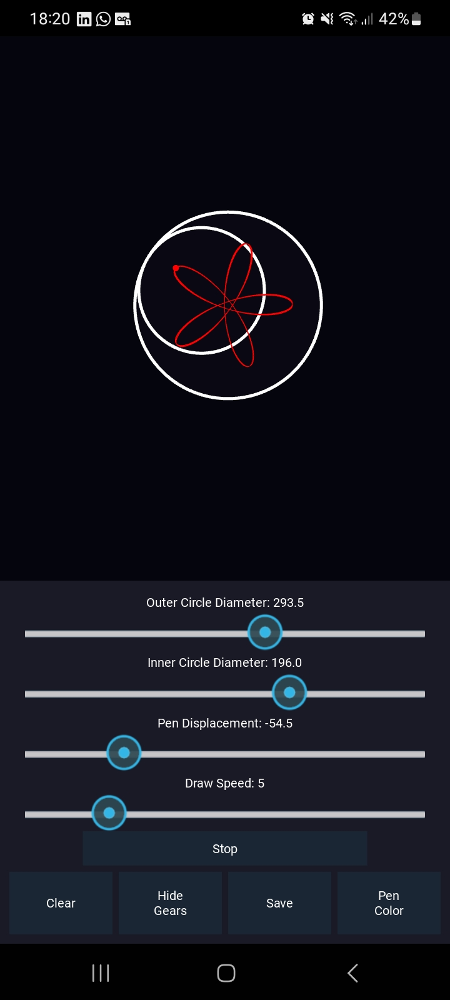
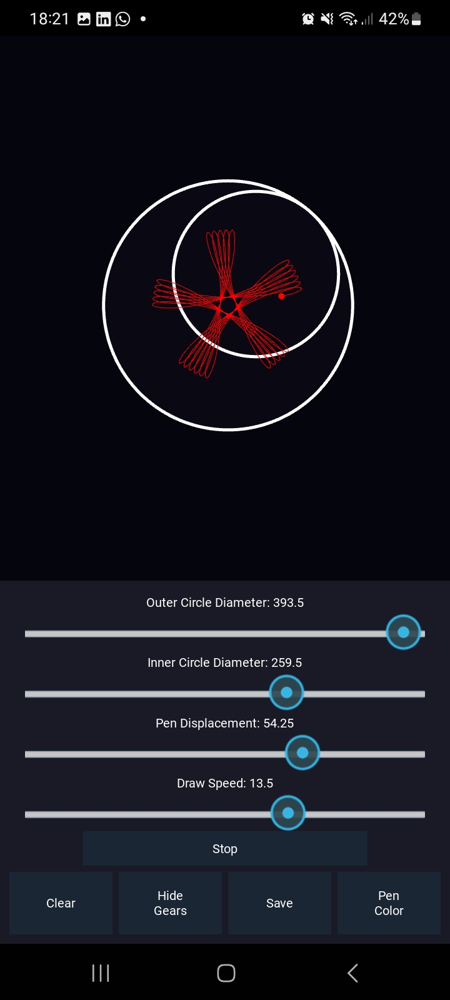

#   Date Started: Thurs-8-Aug-2024


#   Spiroglee

Made with Kivy to create an interface to draw and modify a spirograph.

The compiled APK file is in the `bin` folder.

#	Install Kivy (Windows only)

1.	Setup Terminal
	python -m pip install --upgrade pip setuptools virtualenv
2.	Add and activate virtual environment if you want.
3.	Install Kivy
	python -m pip install "kivy[base]" kivy_examples
	*	Change [base] to [full] to install all kivy features.

##   Date:   Sat-10-Aug-2024

### Comment: Saving the Widget canvas pixels as an image:
```
    Saves what is Displayed on the Draw Area
    There are two methods:
        1.  `export_as_image()`
            This returns an core ~kivy.core.image.Image of the actual widget.
            this Image object can be saved simply by calling its
            `.save("path")` method.
        2.  `export_as_png()`
            Saves an image of the widget and its children in png format at the specified filename. Works by removing the widget canvas from its
            parent, rendering to an ~kivy.graphics.fbo.Fbo, and calling
            ~kivy.graphics.texture.Texture.save.

            :Parameters:
                filename: str
                    The filename with which to save the png.
                scale: float
                    The amount by which to scale the saved image, defaults to 1.
```


### Comment: Adding if-else statement in kivy design language
```
    To stop the gears from being displayed, we changed the color attributes to draw the Ellipses 
    The variables were color_outline and color_fill
    This was used to render the ellipse
    

    This is done for the Outer and Inner gears.
```

##  Date: Wed-21-Aug-2024
### Comment: How to Save to the right Directory in the Android environment
```
    Learnt how to get the path to store data on Android or OS using Python `os` module/

    References: 
        https://stackoverflow.com/questions/42466607/kivy-get-the-path-to-dcim-folder-on-any-android-device
    
    There are two methods to accomplish this:
        1.  Using the `user_data_dir` property
            https://kivy.org/doc/stable/api-kivy.app.html#kivy.app.App. user_data_dir  <-- explanation

            Basically, it returns the path to the directory in the users file system which the application can use to store additional data.

            Use:`   ##  This one is changed
                from kivy.app import user_data_dir
                from os.path import dirname, join

                data_path = join(dirname(user_data_dir), "spiroglee")
            `
            Out Method:
                `
                    from kivy.app import App
                    class myapp(App):
                        def build():
                            ...
                            data_dir = self._get_user_data_dir
                            print(data_dir)
                `
        
        2.  Use the Android Environment variables and accesses them with `os` module:
        Here are some environment variables:
            *EXTERNAL_STORAGE (/storage/emulated/legacy) again   
             symlink to sdcard
            * SECONDARY_STORAGE (/storage/extSdCard) i.e. for the external card if you store photos there
            * EMULATED_STORAGE_TARGET (/storage/emulated) basically a parent folder for your sdcard, where the real sdcard.

    	    Use:`
                data_path = os.getenv("EXTERNAL_STORAGE") if platform is 'android' else "./"

            `
            
        

```

##	This is how it looks once installed:





####    The members of the Popup object

 ['_anim_alpha', '_anim_duration', '_container', '_is_open', '_window', 'anchor_x', 'anchor_y', 'attach_to', 'auto_dismiss', 'background', 'background_color', 'border', 'center', 'center_x', 'center_y', 'children', 'cls', 'content', 'disabled', 'height', 'ids', 'line_color', 'motion_filter', 'opacity', 'overlay_color', 'padding', 'parent', 'pos', 'pos_hint', 'right', 'separator_color', 'separator_height', 'size', 'size_hint', 'size_hint_max', 'size_hint_max_x', 'size_hint_max_y', 'size_hint_min', 'size_hint_min_x', 'size_hint_min_y', 'size_hint_x', 'size_hint_y', 'title', 'title_align', 'title_color', 'title_font', 'title_size', 'top', 'width', 'x', 'y']